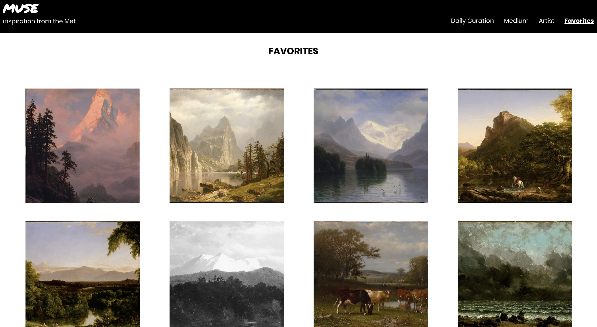
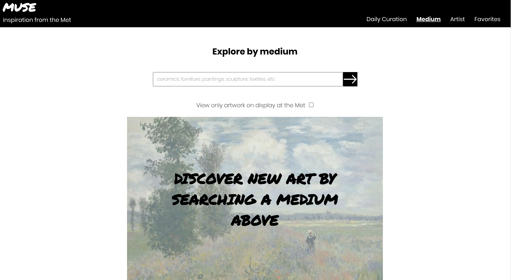
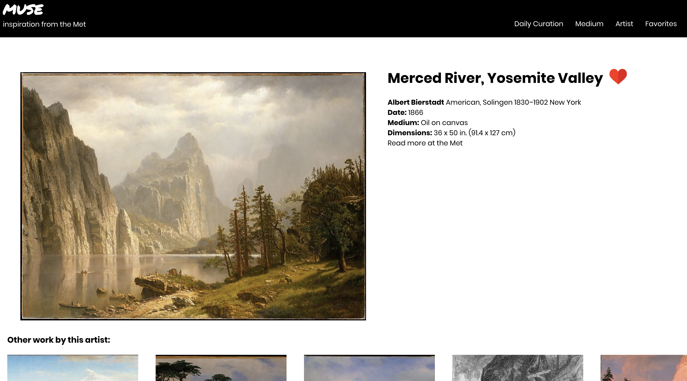
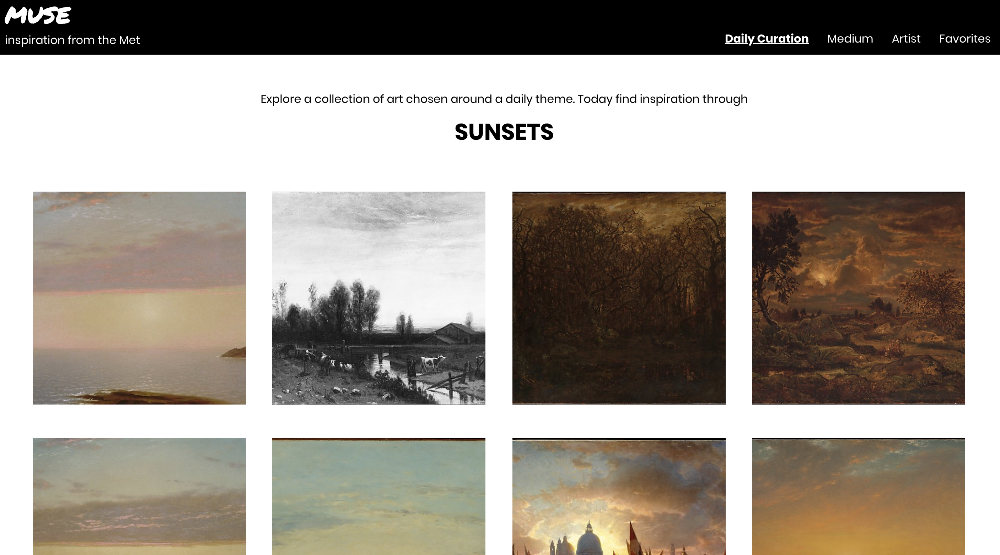
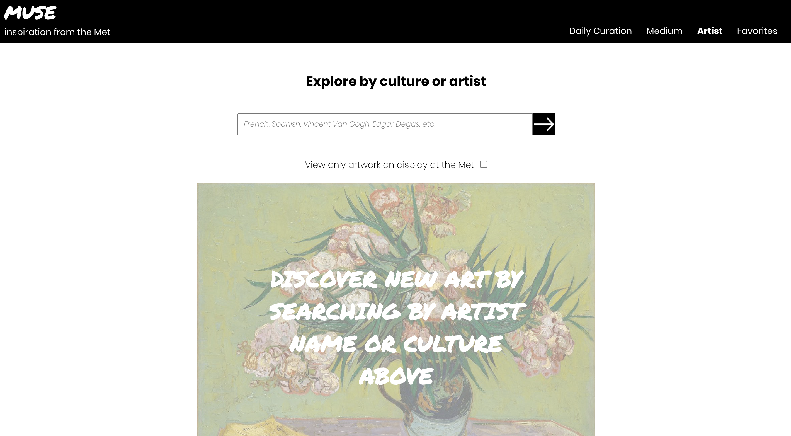

# MUSE 
## inspiration from the Met

### Abstract
Muse is an app for discovering new art by artist, culture, medium or by what is currently on display at the Met museum. Users are able to favorite artwork to build a collection to come back to. Additionally, Muse generates a daily curated selection based on a theme to help users discover new art.

deployed: https://allyjarjour.github.io/muse/

### Technology Used
- React hooks
- React's Context API
- Testing: Jest and React Testing Library

### Wireframe
View my wirefram on Figma here: https://www.figma.com/file/qJGr6EKPDLgajFBIpn4j10/MUSE?node-id=0%3A1

### Setup
- Clone this repo
- Run npm install
- Run npm start

### Future iterations
- Add in a color palette generator for the photo on expanded page
- Add in option to layer in sub categories for search by medium page

#### Favorites page:

#### Search by medium page:

#### Expanded view of artwork page:

#### Daily curation / home page :

#### Search by culture or artist page:

#### Demo

